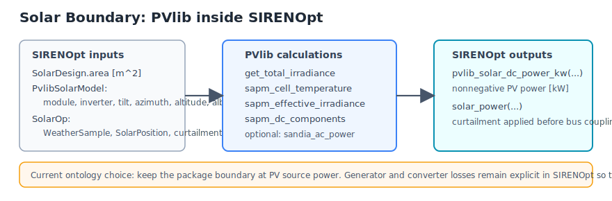
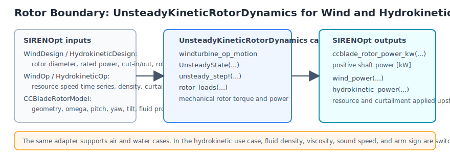
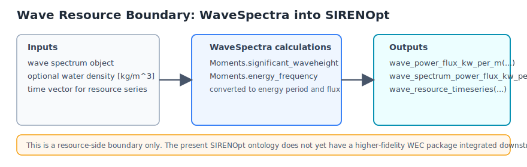
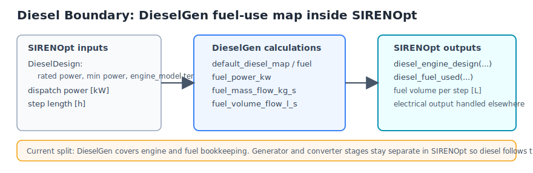
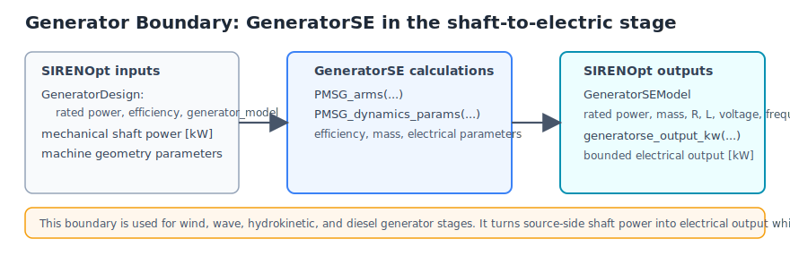
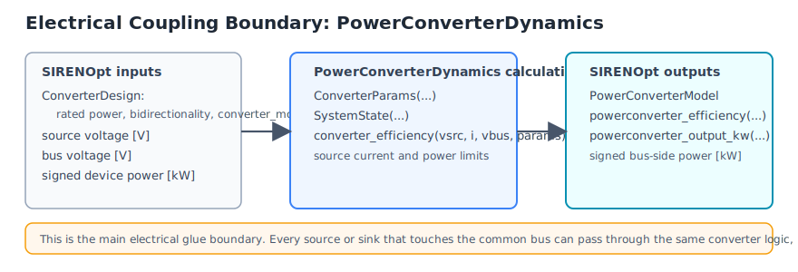
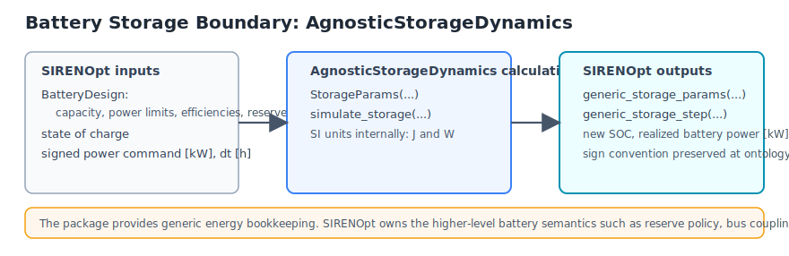
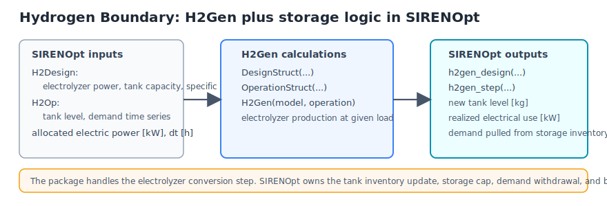
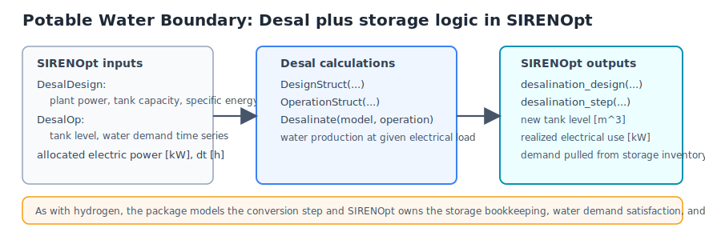
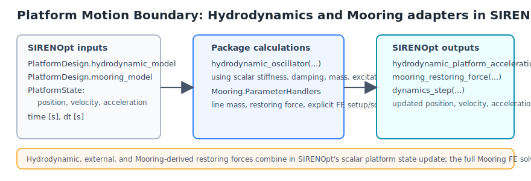

# Theory

SIRENOpt treats the hybrid plant as a coupled dynamic system. At each time step,
resource models produce available energy, conversion subsystems transform that
energy into electrical or stored products, controllers choose setpoints, and the
platform model updates motion-relevant state from aggregate forces and mass.

The ontology boundary is the important design object. Each subsystem should expose
inputs and outputs that are physical, typed where practical, and stable under
fidelity upgrades. For example, a wind or hydrokinetic rotor model should consume
inflow and operating state and return shaft power/loads; a generator model should
consume shaft state and return electrical power/losses; a converter should expose
voltage, current, and efficiency; storage should expose state of charge, spill,
and unmet demand.

Optimization is built around differentiable Julia functions. Smooth approximations
are used where hard active-set changes would otherwise make gradients unreliable.
The solver examples use SNOW, IPOPT, optional SNOPT, ForwardDiff, and
OptimizationParameters to support control co-design experiments with variable
scaling and variable enable/disable workflows.

## Package Boundaries

The diagrams below summarize the current package I/O boundaries used by
`SIRENOpt`. They are checked in as SVG so they can be edited directly in git or
opened in any vector editor.

### Solar: `PVlib`

For the current solar package integration, `PVlib` sits at the
resource-to-array boundary. `WeatherSample` plus solar position determine
plane-of-array irradiance, cell temperature, effective irradiance, and PV DC
output. `SIRENOpt` then keeps generator and converter losses explicit at the
ontology level so electrical coupling remains consistent with wind, wave,
hydrokinetic, diesel, storage, hydrogen, and desalination subsystems. No
implicit solve is used in the current PV path.

### Wind and Hydrokinetic Rotor: `UnsteadyKineticRotorDynamics`

`UnsteadyKineticRotorDynamics` is used at the rotor boundary for both wind and marine
hydrokinetic cases. `SIRENOpt` passes the resource speed, rotor operating
state, and fluid properties to the package and receives positive shaft power in
`kW`. The downstream generator and converter stages remain explicit in
`SIRENOpt`.

### Wave Resource: `WaveSpectra`

`WaveSpectra` currently supplies the resource-side wave boundary only. The
package produces significant wave height and energy period information, which
`SIRENOpt` turns into wave power flux in `kW/m`. A higher-fidelity downstream
WEC package has not yet been integrated at this stage.

### Diesel Engine and Fuel: `DieselGen`

`DieselGen` currently handles the diesel engine map and fuel consumption
bookkeeping. `SIRENOpt` builds a package design object from `DieselDesign`,
evaluates fuel use for a dispatched power level, and keeps the generator and
converter stages separate so the diesel path follows the same bus-coupling
pattern as the renewable sources.

### Generator Stage: `GeneratorSE`

`GeneratorSE` is used as the shaft-to-electric boundary for wind, wave,
hydrokinetic, and diesel generator stages. `SIRENOpt` uses the package to
derive machine efficiency and sizing metadata, then evaluates bounded electrical
output in `kW` at the ontology level.

### Electrical Coupling: `PowerConverterDynamics`

`PowerConverterDynamics` provides the package-backed converter efficiency model
for signed bus coupling. `SIRENOpt` wraps the package in a uniform
source-to-bus and load-to-bus interface so every subsystem can use the same
electrical boundary conventions.

### Battery Storage: `AgnosticStorageDynamics`

`AgnosticStorageDynamics` is the current energy-state package for the battery
subsystem. `SIRENOpt` converts the battery design into the package's SI-unit
parameterization, simulates one storage step, and maps the result back to state
of charge and realized battery power in `kW`.

### Hydrogen Production and Storage: `H2Gen`

`H2Gen` models the electrolyzer conversion step. `SIRENOpt` owns the tank
inventory, power allocation, and external demand satisfaction. This keeps the
package boundary focused on conversion performance while the ontology retains
the system-level storage coupling.

### Desalination and Water Storage: `Desal`

`Desal` is integrated with the same pattern as `H2Gen`: the package models the
conversion step, while `SIRENOpt` owns the storage inventory, power allocation,
and demand withdrawal. This keeps the electrical and mass-balance coupling
explicit at the ontology level.

### Platform Motion and Mooring: `Hydrodynamics`, `Mooring`

`Hydrodynamics` remains available as a scalar placeholder boundary. The present
adapter wraps a 1-DOF oscillator-like call and returns a platform acceleration
that `SIRENOpt` advances explicitly. It is useful for differentiable plumbing
tests and low-order sensitivity work.

The `Hydrodynamics` 6-DOF adapter is the current force-based platform motion
path. `SIRENOpt` stores the hydrodynamic model on
`PlatformDesign.hydrodynamic_model`, initializes a `PlatformState6DOF`, and
passes external wrenches, wave components, velocity history,
direction-selection mode, and optional coefficient diagnostic callbacks into
the Hydrodynamics Cummins-style time-stepper. This keeps BEM hydrodynamic
state, radiation memory, added mass, and wave excitation in the hydrodynamics
package while the system-level energy, water, storage, and bus states remain in
`SIRENOpt`.

`Mooring` is integrated as the platform station-keeping boundary. `SIRENOpt`
builds Mooring.jl parameter handlers from SI point, segment, material, and line
definitions, exposes Mooring.jl line setup and quasi-static solve calls
explicitly, and uses a Mooring-derived linearized restoring force and line mass
inside the scalar platform dynamics path. The full finite-element solve remains
an explicit package call; time-step dynamics use the lightweight force
contribution so hydrodynamic, external, and mooring forces combine at the
ontology level with clear units and sign convention.

