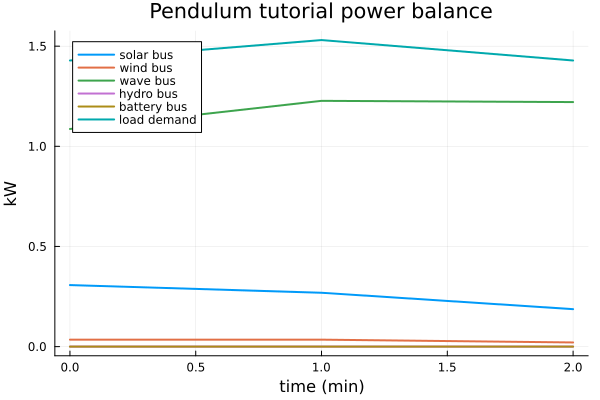
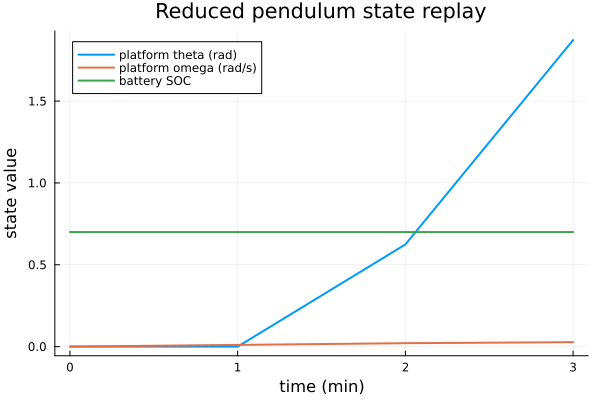
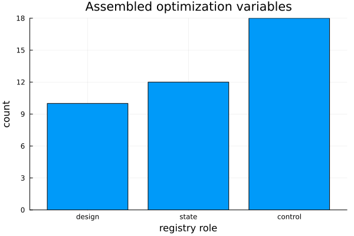

```@meta
EditURL = "../../literate/pendulum_platform_tutorial.jl"
```

# Pendulum Platform Ontology Tutorial

This notebook walks through the reduced pendulum platform example without
hiding the setup behind local helper functions. It shows the building blocks
that matter to a new user:

1. define a short motion-coupled scenario,
2. make a parameter table with `OptimizationParameters.jl`,
3. pass those parameters into the existing ontology builder,
4. inspect the graph, ports, variables, residuals, bounds, and constraints,
5. run `optimize`, `replay`, and `report`,
6. save plots that are pulled into the documentation, and
7. reuse the same parameter table for another fidelity/horizon assembly.

The dynamic platform here is the V1 reduced pendulum fallback. It is useful
for learning the ontology flow and testing force-motion coupling; it is not a
validated hydrodynamic or mooring solve.

````julia
ENV["GKSwstype"] = "100"

using SIRENOpt
using OptimizationParameters
using Plots
````

The notebook can be run from the repository root, from `docs/literate`, or
from the generated notebook location. The checks below keep output paths
stable without requiring a custom setup function.

````julia
repo_root = abspath(joinpath(@__DIR__, "..", ".."))
if !isfile(joinpath(repo_root, "Project.toml")) || !isdir(joinpath(repo_root, "src"))
    repo_root = abspath(joinpath(@__DIR__, "..", "..", ".."))
end
if !isfile(joinpath(repo_root, "Project.toml")) || !isdir(joinpath(repo_root, "src"))
    repo_root = pwd()
end

plot_dir = get(ENV, "SIRENOPT_TUTORIAL_OUTPUT_DIR",
    joinpath(repo_root, "docs", "src", "generated", "pendulum_platform_tutorial"))
report_dir = get(ENV, "SIRENOPT_TUTORIAL_REPORT_DIR",
    joinpath(repo_root, "docs", "src", "generated", "pendulum_platform_tutorial", "reports"))
mkpath(plot_dir)
mkpath(report_dir);
````

## 1. Scenario: a tiny motion-coupled resource window

Keep the first run short. Three one-minute intervals are enough to see
platform pitch feed back into wind availability while keeping the generated
documentation fast.

````julia
scenario = ShortHorizonScenario(
    name = :pendulum_tutorial_short,
    horizon_s = 180.0,
    dt_s = 60.0,
    solar_irradiance_kw_per_m2 = [0.16, 0.14, 0.12],
    wind_speed_m_s = [8.0, 8.0, 8.0],
    wave_power_flux_kw_per_m = [1.0, 1.0, 1.0],
    hydrokinetic_current_m_s = [2.0, 2.0, 2.0],
    load_kw = [1.4, 1.5, 1.4],
    initial_battery_soc = 0.70,
    provenance_note = "Literate pendulum platform ontology tutorial",
);
````

## 2. Parameters: one table for model settings and optimization variables

`OptimizationParameters.jl` separates a physical initial value from scaling,
bounds, and whether the parameter is an active design variable. That mirrors
the larger SNOW examples while staying compact enough to inspect by eye.

````julia
parameters = (
    solar_area_m2 = OptimizationParameter(10.0;
        lb = 2.0, ub = 40.0, scaling = 1.0 / 20.0, dv = true,
        description = "Solar collection area used by the ontology builder"),
    battery_capacity_kwh = OptimizationParameter(5.0;
        lb = 1.0, ub = 20.0, scaling = 1.0 / 10.0, dv = true,
        description = "Battery energy capacity"),
    battery_power_kw = OptimizationParameter(3.0;
        lb = 0.5, ub = 10.0, scaling = 1.0 / 5.0, dv = false,
        description = "Battery charge/discharge power rating"),
    wind_rated_power_kw = OptimizationParameter(4.0;
        lb = 0.5, ub = 15.0, scaling = 1.0 / 8.0, dv = true,
        description = "Wind rotor package boundary rating"),
    wave_capture_width_m = OptimizationParameter(2.0;
        lb = 0.2, ub = 8.0, scaling = 1.0 / 4.0, dv = true,
        description = "Wave/WEC surrogate capture width"),
    wave_rated_power_kw = OptimizationParameter(2.0;
        lb = 0.2, ub = 8.0, scaling = 1.0 / 4.0, dv = false,
        description = "Wave/WEC surrogate PTO rating"),
    hydrokinetic_rated_power_kw = OptimizationParameter(3.0;
        lb = 0.5, ub = 12.0, scaling = 1.0 / 6.0, dv = true,
        description = "Hydrokinetic rotor/generator/converter rating"),
    hydrokinetic_rotor_diameter_m = OptimizationParameter(2.0;
        lb = 0.5, ub = 5.0, scaling = 1.0 / 3.0, dv = false,
        description = "Hydrokinetic rotor diameter"),
    platform_inertia_kg_m2 = OptimizationParameter(1.0e5;
        lb = 2.0e4, ub = 5.0e5, scaling = 1.0 / 1.0e5, dv = true,
        description = "Reduced pendulum pitch inertia"),
    platform_stiffness_nm_per_rad = OptimizationParameter(0.0;
        lb = 0.0, ub = 5.0e4, scaling = 1.0 / 1.0e4, dv = false,
        description = "Optional linear pitch restoring stiffness"),
    platform_damping_nm_s_per_rad = OptimizationParameter(0.0;
        lb = 0.0, ub = 2.0e5, scaling = 1.0 / 1.0e5, dv = false,
        description = "Optional linear pitch damping"),
    wind_platform_moment_per_kw_nm = OptimizationParameter(500.0;
        lb = 50.0, ub = 1200.0, scaling = 1.0 / 500.0, dv = false,
        description = "Pitch moment per kW of wind bus power"),
)

x0_scaled, lower_scaled, upper_scaled = assemble_input(parameters)
parameter_values = get_values(parameters, x0_scaled)
active_parameter_names = [name for name in propertynames(parameters) if get_dv(parameters, name)]

parameter_table = [(
    name = name,
    physical_initial = get_x0(parameters, name),
    lower = get_lb(parameters, name),
    upper = get_ub(parameters, name),
    scaling = get_scaling(parameters, name),
    active_design_variable = get_dv(parameters, name) ? "yes" : "no",
) for name in propertynames(parameters)]

parameter_table
````

````
12-element Vector{@NamedTuple{name::Symbol, physical_initial::Float64, lower::Float64, upper::Float64, scaling::Float64, active_design_variable::String}}:
 (name = :solar_area_m2, physical_initial = 10.0, lower = 2.0, upper = 40.0, scaling = 0.05, active_design_variable = "yes")
 (name = :battery_capacity_kwh, physical_initial = 5.0, lower = 1.0, upper = 20.0, scaling = 0.1, active_design_variable = "yes")
 (name = :battery_power_kw, physical_initial = 3.0, lower = 0.5, upper = 10.0, scaling = 0.2, active_design_variable = "no")
 (name = :wind_rated_power_kw, physical_initial = 4.0, lower = 0.5, upper = 15.0, scaling = 0.125, active_design_variable = "yes")
 (name = :wave_capture_width_m, physical_initial = 2.0, lower = 0.2, upper = 8.0, scaling = 0.25, active_design_variable = "yes")
 (name = :wave_rated_power_kw, physical_initial = 2.0, lower = 0.2, upper = 8.0, scaling = 0.25, active_design_variable = "no")
 (name = :hydrokinetic_rated_power_kw, physical_initial = 3.0, lower = 0.5, upper = 12.0, scaling = 0.16666666666666666, active_design_variable = "yes")
 (name = :hydrokinetic_rotor_diameter_m, physical_initial = 2.0, lower = 0.5, upper = 5.0, scaling = 0.3333333333333333, active_design_variable = "no")
 (name = :platform_inertia_kg_m2, physical_initial = 100000.0, lower = 20000.0, upper = 500000.0, scaling = 1.0e-5, active_design_variable = "yes")
 (name = :platform_stiffness_nm_per_rad, physical_initial = 0.0, lower = 0.0, upper = 50000.0, scaling = 0.0001, active_design_variable = "no")
 (name = :platform_damping_nm_s_per_rad, physical_initial = 0.0, lower = 0.0, upper = 200000.0, scaling = 1.0e-5, active_design_variable = "no")
 (name = :wind_platform_moment_per_kw_nm, physical_initial = 500.0, lower = 50.0, upper = 1200.0, scaling = 0.002, active_design_variable = "no")
````

## 3. Build the pendulum ontology

`DynamicMultilevelHybridOntology` is the existing ontology template. The
keyword arguments below are the model parameters from the table above. Setting
`include_hydrokinetic=true` adds a second package-backed rotor chain so the
model-path table includes both wind and hydrokinetic package boundaries.

````julia
system = DynamicMultilevelHybridOntology(
    scenario = scenario,
    include_hydrokinetic = true,
    solar_area_m2 = parameter_values.solar_area_m2,
    battery_capacity_kwh = parameter_values.battery_capacity_kwh,
    battery_power_kw = parameter_values.battery_power_kw,
    wind_rated_power_kw = parameter_values.wind_rated_power_kw,
    wave_capture_width_m = parameter_values.wave_capture_width_m,
    wave_rated_power_kw = parameter_values.wave_rated_power_kw,
    hydrokinetic_rated_power_kw = parameter_values.hydrokinetic_rated_power_kw,
    hydrokinetic_rotor_diameter_m = parameter_values.hydrokinetic_rotor_diameter_m,
    platform_inertia_kg_m2 = parameter_values.platform_inertia_kg_m2,
    platform_stiffness_nm_per_rad = parameter_values.platform_stiffness_nm_per_rad,
    platform_damping_nm_s_per_rad = parameter_values.platform_damping_nm_s_per_rad,
    wind_platform_moment_per_kw_nm = parameter_values.wind_platform_moment_per_kw_nm,
)

description = describe(system)
component_table(system)
````

````
19-element Vector{NamedTuple{(:name, :role, :component_type, :model_path, :package, :adapter, :required, :enabled)}}:
 (name = :solar_resource, role = :solar_resource, component_type = :resource, model_path = :prescribed, package = nothing, adapter = "ShortHorizonScenario.solar_irradiance_kw_per_m2", required = true, enabled = true)
 (name = :solar_array, role = :solar_array, component_type = :source, model_path = :surrogate, package = nothing, adapter = "linear_solar_array", required = true, enabled = true)
 (name = :solar_converter, role = :converter, component_type = :converter, model_path = :surrogate, package = nothing, adapter = "constant_efficiency_converter", required = true, enabled = true)
 (name = :battery, role = :battery, component_type = :storage, model_path = :surrogate, package = nothing, adapter = "coulombic_battery_inventory", required = true, enabled = true)
 (name = :battery_converter, role = :converter, component_type = :converter, model_path = :surrogate, package = nothing, adapter = "constant_efficiency_converter", required = true, enabled = true)
 (name = :load, role = :load, component_type = :load, model_path = :prescribed, package = nothing, adapter = "ShortHorizonScenario.load_kw", required = true, enabled = true)
 (name = :bus, role = :bus, component_type = :aggregator, model_path = :hard_residual, package = nothing, adapter = "signed_bus_power_balance", required = true, enabled = true)
 (name = :wind_resource, role = :wind_resource, component_type = :resource, model_path = :prescribed, package = nothing, adapter = "ShortHorizonScenario.wind_speed_m_s", required = true, enabled = true)
 (name = :wind_rotor, role = :wind_rotor, component_type = :source, model_path = :package_backed, package = "UnsteadyKineticRotorDynamics", adapter = "simple_ccblade_rotor_model", required = true, enabled = true)
 (name = :wind_generator, role = :generator, component_type = :converter, model_path = :package_backed, package = "GeneratorSE", adapter = "generatorse_output_kw", required = true, enabled = true)
 (name = :wind_converter, role = :converter, component_type = :converter, model_path = :package_backed, package = "PowerConverterDynamics", adapter = "powerconverter_output_kw", required = true, enabled = true)
 (name = :wave_resource, role = :wave_resource, component_type = :resource, model_path = :prescribed, package = nothing, adapter = "ShortHorizonScenario.wave_power_flux_kw_per_m", required = true, enabled = true)
 (name = :wave_wec, role = :wave_wec, component_type = :source, model_path = :surrogate, package = nothing, adapter = "linear_wave_capture_surrogate", required = true, enabled = true)
 (name = :wave_converter, role = :converter, component_type = :converter, model_path = :surrogate, package = nothing, adapter = "constant_efficiency_wave_converter", required = true, enabled = true)
 (name = :hydrokinetic_resource, role = :hydrokinetic_resource, component_type = :resource, model_path = :prescribed, package = nothing, adapter = "ShortHorizonScenario.hydrokinetic_current_m_s", required = true, enabled = true)
 (name = :hydrokinetic_rotor, role = :hydrokinetic_rotor, component_type = :source, model_path = :package_backed, package = "UnsteadyKineticRotorDynamics", adapter = "simple_ccblade_rotor_model", required = true, enabled = true)
 (name = :hydrokinetic_generator, role = :generator, component_type = :converter, model_path = :package_backed, package = "GeneratorSE", adapter = "generatorse_output_kw", required = true, enabled = true)
 (name = :hydrokinetic_converter, role = :converter, component_type = :converter, model_path = :package_backed, package = "PowerConverterDynamics", adapter = "powerconverter_output_kw", required = true, enabled = true)
 (name = :platform, role = :platform, component_type = :platform, model_path = :surrogate, package = nothing, adapter = "pendulum_platform_fallback", required = true, enabled = true)
````

Model-path labels are important in multi-fidelity work. They say which blocks
are package-backed, prescribed, surrogate, or hard residual equations.

````julia
model_path_table(system)
````

````
19-element Vector{NamedTuple{(:block, :model_path, :package, :adapter, :valid_range, :assumptions, :fallback_policy)}}:
 (block = :solar_resource, model_path = :prescribed, package = nothing, adapter = "ShortHorizonScenario.solar_irradiance_kw_per_m2", valid_range = "", assumptions = "externally prescribed scenario data", fallback_policy = "")
 (block = :solar_array, model_path = :surrogate, package = nothing, adapter = "linear_solar_array", valid_range = "", assumptions = "power_kw = irradiance_kw_per_m2 * area_m2 * efficiency", fallback_policy = "replace with PVlib adapter when package-backed weather is active")
 (block = :solar_converter, model_path = :surrogate, package = nothing, adapter = "constant_efficiency_converter", valid_range = "", assumptions = "positive power supplies downstream bus; negative power consumes from bus", fallback_policy = "")
 (block = :battery, model_path = :surrogate, package = nothing, adapter = "coulombic_battery_inventory", valid_range = "", assumptions = "positive command discharges to the bus; dt_s converted once to hours", fallback_policy = "")
 (block = :battery_converter, model_path = :surrogate, package = nothing, adapter = "constant_efficiency_converter", valid_range = "", assumptions = "positive power supplies downstream bus; negative power consumes from bus", fallback_policy = "")
 (block = :load, model_path = :prescribed, package = nothing, adapter = "ShortHorizonScenario.load_kw", valid_range = "", assumptions = "externally prescribed scenario data", fallback_policy = "")
 (block = :bus, model_path = :hard_residual, package = nothing, adapter = "signed_bus_power_balance", valid_range = "", assumptions = "explicit SIRENOpt residual equation", fallback_policy = "")
 (block = :wind_resource, model_path = :prescribed, package = nothing, adapter = "ShortHorizonScenario.wind_speed_m_s", valid_range = "", assumptions = "externally prescribed scenario data", fallback_policy = "")
 (block = :wind_rotor, model_path = :package_backed, package = "UnsteadyKineticRotorDynamics", adapter = "simple_ccblade_rotor_model", valid_range = "", assumptions = "wind speed in m/s; positive shaft power leaves rotor; ForwardDiff sensitivity through dual-valued motion uses SIRENOpt smooth actuator-disk envelope because the current package state is Float64-typed", fallback_policy = "replace with a higher-fidelity wind adapter when rotor states and dual-valued motion are exposed")
 (block = :wind_generator, model_path = :package_backed, package = "GeneratorSE", adapter = "generatorse_output_kw", valid_range = "", assumptions = "shaft power enters generator; positive electrical power leaves generator", fallback_policy = "constant-efficiency generator if GeneratorSE construction is unavailable")
 (block = :wind_converter, model_path = :package_backed, package = "PowerConverterDynamics", adapter = "powerconverter_output_kw", valid_range = "", assumptions = "signed kW converter boundary; positive power injects into the bus", fallback_policy = "constant-efficiency converter if package model is unavailable")
 (block = :wave_resource, model_path = :prescribed, package = nothing, adapter = "ShortHorizonScenario.wave_power_flux_kw_per_m", valid_range = "", assumptions = "externally prescribed scenario data", fallback_policy = "")
 (block = :wave_wec, model_path = :surrogate, package = nothing, adapter = "linear_wave_capture_surrogate", valid_range = "", assumptions = "power_kw = wave_power_flux_kw_per_m * capture_width_m", fallback_policy = "replace with WEC/PTO package adapter when validated residuals are available")
 (block = :wave_converter, model_path = :surrogate, package = nothing, adapter = "constant_efficiency_wave_converter", valid_range = "", assumptions = "positive wave device power injects through converter", fallback_policy = "")
 (block = :hydrokinetic_resource, model_path = :prescribed, package = nothing, adapter = "ShortHorizonScenario.hydrokinetic_current_m_s", valid_range = "", assumptions = "externally prescribed scenario data", fallback_policy = "")
 (block = :hydrokinetic_rotor, model_path = :package_backed, package = "UnsteadyKineticRotorDynamics", adapter = "simple_ccblade_rotor_model", valid_range = "", assumptions = "current speed in m/s; fluid density in kg/m^3; positive shaft power leaves hydrokinetic rotor; ForwardDiff sensitivity through dual-valued resource inputs uses SIRENOpt smooth actuator-disk envelope because the current package state is Float64-typed", fallback_policy = "replace with a higher-fidelity hydrokinetic adapter when rotor states and dual-valued resource inputs are exposed")
 (block = :hydrokinetic_generator, model_path = :package_backed, package = "GeneratorSE", adapter = "generatorse_output_kw", valid_range = "", assumptions = "shaft power enters generator; positive electrical power leaves generator", fallback_policy = "constant-efficiency generator if GeneratorSE construction is unavailable")
 (block = :hydrokinetic_converter, model_path = :package_backed, package = "PowerConverterDynamics", adapter = "powerconverter_output_kw", valid_range = "", assumptions = "signed kW converter boundary; positive power injects into the bus", fallback_policy = "constant-efficiency converter if package model is unavailable")
 (block = :platform, model_path = :surrogate, package = nothing, adapter = "pendulum_platform_fallback", valid_range = "", assumptions = "single pitch DOF; wind moment drives platform pitch", fallback_policy = "replace with validated Hydrodynamics/Mooring force residuals when available")
````

## 4. Audit the graph before running anything

The audit tells us what the ontology will expose under a formulation. Here the
formulation is collocation with terminal SOC equal to the initial SOC, so a
terminal battery residual is registered.

````julia
formulation = Collocation(terminal_soc_equal_initial = true)
system_audit = audit(system, scenario; formulation = formulation)

first(system_audit.port_table, min(8, length(system_audit.port_table)))
````

````
8-element Vector{NamedTuple}:
 (owner = :solar_resource, name = :resource_state, port_type = :resource_state, direction = :out, quantity = :irradiance, unit = "kW/m^2", sign_convention = "positive irradiance increases available solar power", frame = nothing, reference_point = nothing, time_grid = :main, cardinality = :one)
 (owner = :solar_array, name = :resource_state, port_type = :resource_state, direction = :in, quantity = :irradiance, unit = "kW/m^2", sign_convention = "positive irradiance increases available solar power", frame = nothing, reference_point = nothing, time_grid = :main, cardinality = :one)
 (owner = :solar_array, name = :control_signal, port_type = :control_signal, direction = :in, quantity = :curtailment, unit = "fraction", sign_convention = "positive curtailment reduces available solar power", frame = nothing, reference_point = nothing, time_grid = :main, cardinality = :one)
 (owner = :solar_array, name = :device_electrical, port_type = :device_electrical, direction = :out, quantity = :power, unit = "kW", sign_convention = "positive device power leaves the solar array", frame = nothing, reference_point = nothing, time_grid = :main, cardinality = :one)
 (owner = :solar_converter, name = :device_electrical, port_type = :device_electrical, direction = :in, quantity = :power, unit = "kW", sign_convention = "positive power enters converter from solar array", frame = nothing, reference_point = nothing, time_grid = :main, cardinality = :one)
 (owner = :solar_converter, name = :bus_electrical, port_type = :bus_electrical, direction = :out, quantity = :power, unit = "kW", sign_convention = "positive power injects into bus", frame = nothing, reference_point = nothing, time_grid = :main, cardinality = :one)
 (owner = :battery, name = :storage_state, port_type = :storage_state, direction = :out, quantity = :inventory, unit = "fraction", sign_convention = "larger SOC stores more energy", frame = nothing, reference_point = nothing, time_grid = :main, cardinality = :one)
 (owner = :battery, name = :device_electrical, port_type = :device_electrical, direction = :inout, quantity = :power, unit = "kW", sign_convention = "positive device power discharges from battery", frame = nothing, reference_point = nothing, time_grid = :main, cardinality = :one)
````

````julia
first(system_audit.variable_table, min(10, length(system_audit.variable_table)))
````

````
10-element Vector{NamedTuple}:
 (index = 1, owner = :solar_array, name = :solar_area_m2, role = :design, unit = "m^2", scale = 10.0, lower = 0.0, upper = Inf, initial = 10.0, time_index = nothing, scope = :design, model_path = :surrogate, label = "Solar array area")
 (index = 2, owner = :solar_array, name = :solar_curtailment, role = :control, unit = "fraction", scale = 1.0, lower = 0.0, upper = 1.0, initial = 0.0, time_index = 1, scope = :interval, model_path = :surrogate, label = "Solar curtailment")
 (index = 3, owner = :solar_array, name = :solar_curtailment, role = :control, unit = "fraction", scale = 1.0, lower = 0.0, upper = 1.0, initial = 0.0, time_index = 2, scope = :interval, model_path = :surrogate, label = "Solar curtailment")
 (index = 4, owner = :solar_array, name = :solar_curtailment, role = :control, unit = "fraction", scale = 1.0, lower = 0.0, upper = 1.0, initial = 0.0, time_index = 3, scope = :interval, model_path = :surrogate, label = "Solar curtailment")
 (index = 5, owner = :solar_converter, name = :solar_converter_rating_kw, role = :design, unit = "kW", scale = 10.0, lower = 0.0, upper = Inf, initial = 10.0, time_index = nothing, scope = :design, model_path = :surrogate, label = "Solar converter rating")
 (index = 6, owner = :battery, name = :battery_capacity_kwh, role = :design, unit = "kWh", scale = 5.0, lower = 2.220446049250313e-16, upper = Inf, initial = 5.0, time_index = nothing, scope = :design, model_path = :surrogate, label = "Battery capacity")
 (index = 7, owner = :battery, name = :battery_power_kw, role = :design, unit = "kW", scale = 3.0, lower = 2.220446049250313e-16, upper = Inf, initial = 3.0, time_index = nothing, scope = :design, model_path = :surrogate, label = "Battery power rating")
 (index = 8, owner = :battery, name = :battery_soc, role = :state, unit = "fraction", scale = 1.0, lower = 0.0, upper = 1.0, initial = 0.7, time_index = 1, scope = :node, model_path = :surrogate, label = "Battery state of charge")
 (index = 9, owner = :battery, name = :battery_soc, role = :state, unit = "fraction", scale = 1.0, lower = 0.0, upper = 1.0, initial = 0.7, time_index = 2, scope = :node, model_path = :surrogate, label = "Battery state of charge")
 (index = 10, owner = :battery, name = :battery_soc, role = :state, unit = "fraction", scale = 1.0, lower = 0.0, upper = 1.0, initial = 0.7, time_index = 3, scope = :node, model_path = :surrogate, label = "Battery state of charge")
````

````julia
filter(row -> row.owner in (:platform, :battery, :wave_wec, :bus),
    system_audit.residual_table)
````

````
25-element Vector{NamedTuple}:
 (index = 10, owner = :battery, name = :battery_inventory, sense = :eq, unit = "kWh", scale = 5.0, lower = 0.0, upper = 0.0, time_index = 1, scope = :interval, model_path = :surrogate, label = "Battery SOC inventory")
 (index = 11, owner = :battery, name = :battery_inventory, sense = :eq, unit = "kWh", scale = 5.0, lower = 0.0, upper = 0.0, time_index = 2, scope = :interval, model_path = :surrogate, label = "Battery SOC inventory")
 (index = 12, owner = :battery, name = :battery_inventory, sense = :eq, unit = "kWh", scale = 5.0, lower = 0.0, upper = 0.0, time_index = 3, scope = :interval, model_path = :surrogate, label = "Battery SOC inventory")
 (index = 13, owner = :battery, name = :battery_power_limit, sense = :geq, unit = "kW", scale = 3.0, lower = 0.0, upper = Inf, time_index = 1, scope = :interval, model_path = :surrogate, label = "Battery power margin")
 (index = 14, owner = :battery, name = :battery_power_limit, sense = :geq, unit = "kW", scale = 3.0, lower = 0.0, upper = Inf, time_index = 2, scope = :interval, model_path = :surrogate, label = "Battery power margin")
 (index = 15, owner = :battery, name = :battery_power_limit, sense = :geq, unit = "kW", scale = 3.0, lower = 0.0, upper = Inf, time_index = 3, scope = :interval, model_path = :surrogate, label = "Battery power margin")
 (index = 28, owner = :bus, name = :bus_power_balance, sense = :eq, unit = "kW", scale = 1.0, lower = 0.0, upper = 0.0, time_index = 1, scope = :interval, model_path = :hard_residual, label = "Bus power balance")
 (index = 29, owner = :bus, name = :bus_power_balance, sense = :eq, unit = "kW", scale = 1.0, lower = 0.0, upper = 0.0, time_index = 2, scope = :interval, model_path = :hard_residual, label = "Bus power balance")
 (index = 30, owner = :bus, name = :bus_power_balance, sense = :eq, unit = "kW", scale = 1.0, lower = 0.0, upper = 0.0, time_index = 3, scope = :interval, model_path = :hard_residual, label = "Bus power balance")
 (index = 46, owner = :wave_wec, name = :wave_available_limit, sense = :geq, unit = "kW", scale = 2.0, lower = 0.0, upper = Inf, time_index = 1, scope = :interval, model_path = :surrogate, label = "Wave available power cap")
 (index = 47, owner = :wave_wec, name = :wave_available_limit, sense = :geq, unit = "kW", scale = 2.0, lower = 0.0, upper = Inf, time_index = 2, scope = :interval, model_path = :surrogate, label = "Wave available power cap")
 (index = 48, owner = :wave_wec, name = :wave_available_limit, sense = :geq, unit = "kW", scale = 2.0, lower = 0.0, upper = Inf, time_index = 3, scope = :interval, model_path = :surrogate, label = "Wave available power cap")
 (index = 49, owner = :wave_wec, name = :wave_rating_limit, sense = :geq, unit = "kW", scale = 2.0, lower = 0.0, upper = Inf, time_index = 1, scope = :interval, model_path = :surrogate, label = "Wave rated power margin")
 (index = 50, owner = :wave_wec, name = :wave_rating_limit, sense = :geq, unit = "kW", scale = 2.0, lower = 0.0, upper = Inf, time_index = 2, scope = :interval, model_path = :surrogate, label = "Wave rated power margin")
 (index = 51, owner = :wave_wec, name = :wave_rating_limit, sense = :geq, unit = "kW", scale = 2.0, lower = 0.0, upper = Inf, time_index = 3, scope = :interval, model_path = :surrogate, label = "Wave rated power margin")
 (index = 52, owner = :wave_wec, name = :wave_pto_limit, sense = :geq, unit = "kW", scale = 2.0, lower = 0.0, upper = Inf, time_index = 1, scope = :interval, model_path = :surrogate, label = "WEC PTO power margin")
 (index = 53, owner = :wave_wec, name = :wave_pto_limit, sense = :geq, unit = "kW", scale = 2.0, lower = 0.0, upper = Inf, time_index = 2, scope = :interval, model_path = :surrogate, label = "WEC PTO power margin")
 (index = 54, owner = :wave_wec, name = :wave_pto_limit, sense = :geq, unit = "kW", scale = 2.0, lower = 0.0, upper = Inf, time_index = 3, scope = :interval, model_path = :surrogate, label = "WEC PTO power margin")
 (index = 73, owner = :platform, name = :platform_kinematic_defect, sense = :eq, unit = "rad", scale = 1.0, lower = 0.0, upper = 0.0, time_index = 1, scope = :interval, model_path = :surrogate, label = "Platform pitch kinematic defect")
 (index = 74, owner = :platform, name = :platform_kinematic_defect, sense = :eq, unit = "rad", scale = 1.0, lower = 0.0, upper = 0.0, time_index = 2, scope = :interval, model_path = :surrogate, label = "Platform pitch kinematic defect")
 (index = 75, owner = :platform, name = :platform_kinematic_defect, sense = :eq, unit = "rad", scale = 1.0, lower = 0.0, upper = 0.0, time_index = 3, scope = :interval, model_path = :surrogate, label = "Platform pitch kinematic defect")
 (index = 76, owner = :platform, name = :platform_dynamic_defect, sense = :eq, unit = "rad/s", scale = 1.0, lower = 0.0, upper = 0.0, time_index = 1, scope = :interval, model_path = :surrogate, label = "Platform pitch dynamic defect")
 (index = 77, owner = :platform, name = :platform_dynamic_defect, sense = :eq, unit = "rad/s", scale = 1.0, lower = 0.0, upper = 0.0, time_index = 2, scope = :interval, model_path = :surrogate, label = "Platform pitch dynamic defect")
 (index = 78, owner = :platform, name = :platform_dynamic_defect, sense = :eq, unit = "rad/s", scale = 1.0, lower = 0.0, upper = 0.0, time_index = 3, scope = :interval, model_path = :surrogate, label = "Platform pitch dynamic defect")
 (index = 79, owner = :battery, name = :battery_terminal_soc, sense = :eq, unit = "kWh", scale = 1.0, lower = 0.0, upper = 0.0, time_index = nothing, scope = :terminal, model_path = :surrogate, label = "Battery terminal SOC equals initial SOC")
````

## 5. Assemble the optimization vectors

`assemble` is the bridge from block metadata to the numerical arrays that an
optimizer sees. The registry records owner/name/time index for each vector
entry, plus lower/upper bounds and residual bounds.

````julia
model = assemble(system, scenario, formulation)

(
    variable_count = length(model.x0),
    constraint_count = length(model.constraint_lower_bounds),
)
````

````
(variable_count = 40, constraint_count = 79)
````

````julia
first(variable_table(model.registry), 12)
````

````
12-element Vector{NamedTuple{(:index, :owner, :name, :role, :unit, :scale, :lower, :upper, :initial, :time_index, :scope, :model_path, :label)}}:
 (index = 1, owner = :solar_array, name = :solar_area_m2, role = :design, unit = "m^2", scale = 10.0, lower = 0.0, upper = Inf, initial = 10.0, time_index = nothing, scope = :design, model_path = :surrogate, label = "Solar array area")
 (index = 2, owner = :solar_array, name = :solar_curtailment, role = :control, unit = "fraction", scale = 1.0, lower = 0.0, upper = 1.0, initial = 0.0, time_index = 1, scope = :interval, model_path = :surrogate, label = "Solar curtailment")
 (index = 3, owner = :solar_array, name = :solar_curtailment, role = :control, unit = "fraction", scale = 1.0, lower = 0.0, upper = 1.0, initial = 0.0, time_index = 2, scope = :interval, model_path = :surrogate, label = "Solar curtailment")
 (index = 4, owner = :solar_array, name = :solar_curtailment, role = :control, unit = "fraction", scale = 1.0, lower = 0.0, upper = 1.0, initial = 0.0, time_index = 3, scope = :interval, model_path = :surrogate, label = "Solar curtailment")
 (index = 5, owner = :solar_converter, name = :solar_converter_rating_kw, role = :design, unit = "kW", scale = 10.0, lower = 0.0, upper = Inf, initial = 10.0, time_index = nothing, scope = :design, model_path = :surrogate, label = "Solar converter rating")
 (index = 6, owner = :battery, name = :battery_capacity_kwh, role = :design, unit = "kWh", scale = 5.0, lower = 2.220446049250313e-16, upper = Inf, initial = 5.0, time_index = nothing, scope = :design, model_path = :surrogate, label = "Battery capacity")
 (index = 7, owner = :battery, name = :battery_power_kw, role = :design, unit = "kW", scale = 3.0, lower = 2.220446049250313e-16, upper = Inf, initial = 3.0, time_index = nothing, scope = :design, model_path = :surrogate, label = "Battery power rating")
 (index = 8, owner = :battery, name = :battery_soc, role = :state, unit = "fraction", scale = 1.0, lower = 0.0, upper = 1.0, initial = 0.7, time_index = 1, scope = :node, model_path = :surrogate, label = "Battery state of charge")
 (index = 9, owner = :battery, name = :battery_soc, role = :state, unit = "fraction", scale = 1.0, lower = 0.0, upper = 1.0, initial = 0.7, time_index = 2, scope = :node, model_path = :surrogate, label = "Battery state of charge")
 (index = 10, owner = :battery, name = :battery_soc, role = :state, unit = "fraction", scale = 1.0, lower = 0.0, upper = 1.0, initial = 0.7, time_index = 3, scope = :node, model_path = :surrogate, label = "Battery state of charge")
 (index = 11, owner = :battery, name = :battery_soc, role = :state, unit = "fraction", scale = 1.0, lower = 0.0, upper = 1.0, initial = 0.7, time_index = 4, scope = :node, model_path = :surrogate, label = "Battery state of charge")
 (index = 12, owner = :battery, name = :battery_command_kw, role = :control, unit = "kW", scale = 3.0, lower = -3.0, upper = 3.0, initial = 0.0, time_index = 1, scope = :interval, model_path = :surrogate, label = "Battery command")
````

````julia
design_rows = filter(row -> row.role == :design, variable_table(model.registry))
state_rows = filter(row -> row.role == :state, variable_table(model.registry))
control_rows = filter(row -> row.role == :control, variable_table(model.registry))

(
    design_variables = length(design_rows),
    state_variables = length(state_rows),
    control_variables = length(control_rows),
)
````

````
(design_variables = 10, state_variables = 12, control_variables = 18)
````

## 6. Optimize, replay, and report

The small deterministic solve fills a feasible collocation vector for this
tutorial-sized case. `replay` then rebuilds the physical time series from the
chosen controls and states. `report` writes CSVs and SVGs from the metadata.

````julia
result = optimize(system, scenario; formulation = formulation)
replayed = replay(result)
reported = report(result, report_dir)

result.replay_summary
````

````
(max_abs_bus_balance_residual_kw = 2.220446049250313e-16, max_abs_battery_inventory_residual_kwh = 0.0, max_abs_diesel_fuel_inventory_residual_l = 0.0, max_abs_h2_inventory_residual_kg = 0.0, max_abs_desal_inventory_residual_m3 = 0.0, max_abs_platform_kinematic_residual_rad = 0.0, max_abs_platform_dynamic_residual_rad_s = 0.0, max_registered_constraint_violation = 2.220446049250313e-16, feasible = true)
````

## 7. Save tutorial plots

These are simple teaching plots. The standard ontology report also writes its
own SVGs in `report_dir`, but these smaller figures focus on power balance,
platform motion, and variable layout.

````julia
times_min = [row.time_s / 60.0 for row in result.timeseries]
state_times_min = [row.time_s / 60.0 for row in result.states]

solar_bus = [row.solar_bus_power_kw for row in result.timeseries]
wind_bus = [row.wind_bus_power_kw for row in result.timeseries]
wave_bus = [row.wave_bus_power_kw for row in result.timeseries]
hydro_bus = [row.hydrokinetic_bus_power_kw for row in result.timeseries]
battery_bus = [row.battery_bus_power_kw for row in result.timeseries]
load_bus = [-row.load_bus_power_kw for row in result.timeseries]

theta = [row.platform_theta_rad for row in result.states]
omega = [row.platform_omega_rad_s for row in result.states]
soc = [row.battery_soc for row in result.states]

role_names = ["design", "state", "control"]
role_counts = [length(design_rows), length(state_rows), length(control_rows)]

power_plot = Plots.plot(times_min, [solar_bus wind_bus wave_bus hydro_bus battery_bus load_bus];
    label = ["solar bus" "wind bus" "wave bus" "hydro bus" "battery bus" "load demand"],
    xlabel = "time (min)", ylabel = "kW", linewidth = 2,
    title = "Pendulum tutorial power balance")
power_plot_path = joinpath(plot_dir, "pendulum_power_balance.svg")
Plots.savefig(power_plot, power_plot_path)

motion_plot = Plots.plot(state_times_min, [theta omega soc];
    label = ["platform theta (rad)" "platform omega (rad/s)" "battery SOC"],
    xlabel = "time (min)", ylabel = "state value", linewidth = 2,
    title = "Reduced pendulum state replay")
motion_plot_path = joinpath(plot_dir, "pendulum_motion_states.svg")
Plots.savefig(motion_plot, motion_plot_path)

layout_plot = Plots.bar(role_names, role_counts;
    label = "", xlabel = "registry role", ylabel = "count",
    title = "Assembled optimization variables")
layout_plot_path = joinpath(plot_dir, "pendulum_registry_layout.svg")
Plots.savefig(layout_plot, layout_plot_path)

(
    power_plot = relpath(power_plot_path, repo_root),
    motion_plot = relpath(motion_plot_path, repo_root),
    layout_plot = relpath(layout_plot_path, repo_root),
)
````

````
(power_plot = "src/generated/pendulum_platform_tutorial/pendulum_power_balance.svg", motion_plot = "src/generated/pendulum_platform_tutorial/pendulum_motion_states.svg", layout_plot = "src/generated/pendulum_platform_tutorial/pendulum_registry_layout.svg")
````







## 8. Reuse the same parameter table across fidelity and horizon

The next simplest use case is not hand-packing a callback. It is selecting an
ontology template, passing model parameters, and letting `assemble` build the
vector layout for the chosen formulation. Below, the same parameter table is
reused for a short high-fidelity-ish graph with hydrokinetic enabled and a
longer reduced graph with hydrokinetic disabled. Both are assembled with the
same formulation.

````julia
hourly_scenario = ShortHorizonScenario(
    name = :pendulum_tutorial_hourly,
    horizon_s = 6 * 3600.0,
    dt_s = 3600.0,
    solar_irradiance_kw_per_m2 = [0.05, 0.20, 0.50, 0.65, 0.35, 0.10],
    wind_speed_m_s = [7.0, 7.6, 8.1, 8.5, 8.0, 7.4],
    wave_power_flux_kw_per_m = fill(1.0, 6),
    hydrokinetic_current_m_s = fill(2.0, 6),
    load_kw = fill(1.4, 6),
    initial_battery_soc = 0.70,
    provenance_note = "Longer horizon tutorial assembly",
)

short_package_graph = system

hourly_reduced_graph = DynamicMultilevelHybridOntology(
    scenario = hourly_scenario,
    include_hydrokinetic = false,
    solar_area_m2 = parameter_values.solar_area_m2,
    battery_capacity_kwh = parameter_values.battery_capacity_kwh,
    battery_power_kw = parameter_values.battery_power_kw,
    wind_rated_power_kw = parameter_values.wind_rated_power_kw,
    wave_capture_width_m = parameter_values.wave_capture_width_m,
    wave_rated_power_kw = parameter_values.wave_rated_power_kw,
    platform_inertia_kg_m2 = parameter_values.platform_inertia_kg_m2,
    platform_stiffness_nm_per_rad = parameter_values.platform_stiffness_nm_per_rad,
    platform_damping_nm_s_per_rad = parameter_values.platform_damping_nm_s_per_rad,
    wind_platform_moment_per_kw_nm = parameter_values.wind_platform_moment_per_kw_nm,
)

short_package_model = assemble(short_package_graph, scenario, formulation)
hourly_reduced_model = assemble(hourly_reduced_graph, hourly_scenario, formulation)

horizon_and_fidelity_table = [
    (
        case = :short_package_graph,
        horizon_s = scenario.time_grids.main.horizon_s,
        dt_s = scenario.time_grids.main.dt_s,
        blocks = length(component_table(short_package_graph)),
        package_backed_blocks = count(row -> row.model_path == :package_backed,
            model_path_table(short_package_graph)),
        variables = length(short_package_model.x0),
        constraints = length(short_package_model.constraint_lower_bounds),
    ),
    (
        case = :hourly_reduced_graph,
        horizon_s = hourly_scenario.time_grids.main.horizon_s,
        dt_s = hourly_scenario.time_grids.main.dt_s,
        blocks = length(component_table(hourly_reduced_graph)),
        package_backed_blocks = count(row -> row.model_path == :package_backed,
            model_path_table(hourly_reduced_graph)),
        variables = length(hourly_reduced_model.x0),
        constraints = length(hourly_reduced_model.constraint_lower_bounds),
    ),
]

horizon_and_fidelity_table
````

````
2-element Vector{@NamedTuple{case::Symbol, horizon_s::Float64, dt_s::Float64, blocks::Int64, package_backed_blocks::Int64, variables::Int64, constraints::Int64}}:
 (case = :short_package_graph, horizon_s = 180.0, dt_s = 60.0, blocks = 19, package_backed_blocks = 6, variables = 40, constraints = 79)
 (case = :hourly_reduced_graph, horizon_s = 21600.0, dt_s = 3600.0, blocks = 15, package_backed_blocks = 3, variables = 60, constraints = 127)
````

The important pattern is that the user-level code stayed declarative. The
parameter table carried scaling and design-variable activation; the ontology
builder selected model fidelity; and `assemble` generated the optimizer-facing
variable and residual layout for each horizon.

